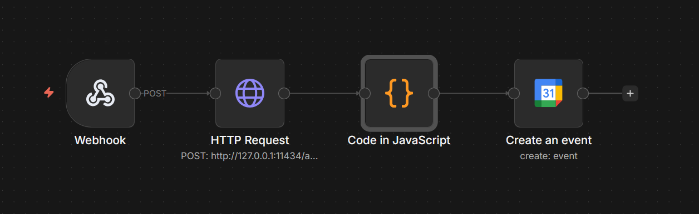

# AI-Powered Activity to Google Calendar 📅✨

> **Short & simple:** This project watches what app or website you’re using and neatly turns it into calendar events, so you can see where your day really went. No deep tech knowledge needed. ✅🧠

It automatically logs your computer activity into Google Calendar with task categorization and productivity scoring, using AI to process application/window activity data. 🤖⏱️

It captures activity from a webhook, extracts relevant details using an AI (like Ollama), and creates structured Google Calendar events. 🚀

---

## Visual Flow 🧭



---

## Features ✅

- Logs application usage, window title, and URL.
- Extracts task and category information using AI.
- Computes a productivity score for each activity.
- Creates Google Calendar events automatically.
- Handles missing data gracefully (shows "N/A" if task/score/URL unavailable).
- Supports multiple AI backends (local or hosted) as long as they return JSON.
- Clear webhook contract for easy integration with any activity logger.
- Simple environment-based configuration.

---

## Quick Snapshot ⚡

| What it does | Why it helps |
| --- | --- |
| Turns app usage into calendar events | See your day clearly at a glance |
| Auto labels tasks and categories | Understand patterns without manual logging |
| Calculates a productivity score | Quick feedback on focus time |

---

## Table of Contents 📚

1. [Prerequisites](#prerequisites)
2. [Installation](#installation)
3. [Configuration](#configuration)
4. [Local Setup (Step-by-step)](#local-setup-step-by-step)
5. [Google API Setup](#google-api-setup)
6. [Webhook Setup](#webhook-setup)
7. [Code Overview](#code-overview)
8. [Running the Node](#running-the-node)
9. [Sample Output](#sample-output)
10. [Troubleshooting](#troubleshooting)
11. [Security Notes](#security-notes)
12. [Roadmap](#roadmap)
13. [License](#license)

---

## Prerequisites 🧰

Before you begin, make sure you have the following:

- Node.js >= 18
- Access to a Google account with Calendar enabled
- A webhook source sending activity data (e.g., browser extension, Zen Browser, or custom logger)
- Optional: Ollama AI API or any AI capable of returning JSON task categorization

### Requirements Table

| Requirement | Why it matters |
| --- | --- |
| Node.js 18+ | Runs the server |
| Google Calendar access | Where events are created |
| Activity logger or webhook source | Feeds app activity data |
| Optional AI endpoint | Auto task categorization |

---

## Installation 🧩

1. Clone the repository:

```bash
git clone https://github.com/yourusername/activity-to-google-calendar.git
cd activity-to-google-calendar
```

2. Install dependencies:

```bash
npm install
```

3. Create credentials and configure the environment (see below).

---

## Configuration ⚙️

### Quick Start Checklist

| Step | Done? | Notes |
| --- | --- | --- |
| Install Node.js 18+ | ☐ | `node -v` |
| Create Google API credentials | ☐ | OAuth Client ID or Service Account |
| Save `credentials.json` | ☐ | In project root |
| Create `.env` | ☐ | See table below |
| Start server | ☐ | `node index.js` |
| Send test webhook | ☐ | Use curl or Postman |

### Environment Variables

Create a `.env` file in the project root with the following:

```
GOOGLE_CREDENTIALS=./credentials.json
GOOGLE_CALENDAR_ID=primary
WEBHOOK_PORT=5678
```

| Variable | Required | Default | Example | Description |
| --- | --- | --- | --- | --- |
| `GOOGLE_CREDENTIALS` | Yes | - | `./credentials.json` | Path to Google credentials JSON |
| `GOOGLE_CALENDAR_ID` | No | `primary` | `primary` | Calendar where events are created |
| `WEBHOOK_PORT` | No | `5678` | `5678` | Port for incoming webhook activity |

### AI Configuration (Optional)

If using Ollama or another AI API, configure your API endpoint and model:

```
AI_ENDPOINT=http://localhost:11434
AI_MODEL=ollama-model
```

| Variable | Required | Default | Example | Description |
| --- | --- | --- | --- | --- |
| `AI_ENDPOINT` | No | - | `http://localhost:11434` | AI endpoint that returns JSON |
| `AI_MODEL` | No | - | `ollama-model` | Model name or identifier |

### Ports and Endpoints

| Item | Example | Description |
| --- | --- | --- |
| Webhook URL | `http://localhost:5678/webhook` | Endpoint that receives activity JSON |
| AI Endpoint | `http://localhost:11434` | AI server URL (if used) |

---

## Local Setup (Step-by-step) 🚦

1. Install Node.js 18+ and confirm with `node -v`.
2. Clone the repository and enter the folder:

```bash
git clone https://github.com/yourusername/activity-to-google-calendar.git
cd activity-to-google-calendar
```

3. Install dependencies:

```bash
npm install
```

4. Create your Google API credentials (see next section) and save them as `credentials.json` in the project root.
5. Create a `.env` file and set at least `GOOGLE_CREDENTIALS` and `WEBHOOK_PORT`.
6. Start the server:

```bash
node index.js
```

7. Send a test webhook to confirm it works:

```bash
curl -X POST http://localhost:5678/webhook -H "Content-Type: application/json" -d "{\"app_name\":\"Test App\",\"window_title\":\"Test Window\",\"url\":\"https://example.com\",\"duration_seconds\":120,\"timestamp\":\"2026-04-07T21:30:00Z\"}"
```

8. Confirm a new event appears in your Google Calendar.

---

## Google API Setup 🔐

You can authenticate using either an OAuth Client ID (recommended for personal use) or a Service Account (recommended for team/automation, but requires calendar sharing).

### Option A: OAuth Client ID (recommended)

1. In Google Cloud Console, create a new project.
2. Enable the Google Calendar API for the project.
3. Create OAuth credentials (OAuth Client ID).
4. Download the credentials JSON and place it in the project folder.
5. Set `GOOGLE_CREDENTIALS=./credentials.json` in your `.env`.

### Option B: Service Account

1. Create a Service Account in Google Cloud Console.
2. Enable the Google Calendar API.
3. Download the JSON key and place it in the project folder.
4. Share your target calendar with the service account email.
5. Set `GOOGLE_CREDENTIALS=./credentials.json` in your `.env`.

If you are unsure which to pick, start with OAuth Client ID.

---

## Webhook Setup 🪝

Your AI or logging system needs to send activity data in JSON format via a webhook.

Example JSON payload:

```json
{
  "app_name": "Google Chrome",
  "window_title": "YouTube - funny cat video",
  "url": "https://youtube.com/watch?v=abc123",
  "duration_seconds": 180,
  "timestamp": "2026-04-07T21:30:00"
}
```

- `app_name` → Name of the application.
- `window_title` → Current window title.
- `url` → URL of the active tab (if applicable).
- `duration_seconds` → Duration of the activity in seconds.
- `timestamp` → ISO 8601 timestamp when activity started.

### Webhook Payload Schema

| Field | Type | Required | Example | Notes |
| --- | --- | --- | --- | --- |
| `app_name` | string | Yes | `Google Chrome` | Application name |
| `window_title` | string | Yes | `YouTube - funny cat video` | Window or tab title |
| `url` | string | No | `https://youtube.com/watch?v=abc123` | Optional URL |
| `duration_seconds` | number | Yes | `180` | Duration of activity |
| `timestamp` | string | Yes | `2026-04-07T21:30:00Z` | ISO 8601 with timezone |

---

## Code Overview 🧠

The main workflow:

1. Receive Webhook Data
2. Capture activity data from a webhook.
3. Process AI Response
4. Parse AI JSON to extract task name, category, and productivity score.
5. Compute Event Duration
6. Convert `duration_seconds` to start and end timestamps.
7. Build Calendar Event
8. Create a structured Google Calendar event:

Title: `{Task Category} — {Window Title} ({Minutes} min)`

Description:

```
App: {app_name}
URL: {url}
Task: {task_name}
Productivity Score: {productivity_score}
```

9. Send to Google Calendar
10. Push the event to the configured Google Calendar.

### Expected AI JSON Schema

Your AI endpoint should return JSON with the following shape:

```json
{
  "task_name": "Write documentation",
  "task_category": "Work",
  "productivity_score": 82
}
```

- `task_name` is a short summary of the activity.
- `task_category` is a high-level label such as Work, Learning, or Entertainment.
- `productivity_score` is a number from 0 to 100.

If any field is missing, the system will fall back to `N/A`.

| Field | Type | Required | Example | Notes |
| --- | --- | --- | --- | --- |
| `task_name` | string | No | `Write documentation` | Short summary |
| `task_category` | string | No | `Work` | High-level label |
| `productivity_score` | number | No | `82` | 0 to 100 |

---

## Running the Node ▶️

Start the Node.js process:

```bash
node index.js
```

It will listen for incoming webhook activity and automatically push events to Google Calendar.

### Running in the Background

If you want this to run all day, use a process manager like:

- `pm2` (Node process manager)
- `nssm` or Task Scheduler on Windows

---

## Sample Output 📝

Google Calendar Event Example:

Title: `Task — YouTube - funny cat video (3 min)`

Description:

```
App: Google Chrome
URL: https://youtube.com/watch?v=abc123
Task: YouTube - funny cat video
Productivity Score: 85
```

Start: `2026-04-07T21:30:00Z`  
End: `2026-04-07T21:33:00Z`

---

## Troubleshooting 🧯

- Task shows N/A:
  Ensure AI response JSON includes `task_name`.
- Productivity Score stuck at default:
  Check AI output JSON includes `productivity_score`.
- URL not visible:
  Make sure the webhook payload includes the `url` field.
- Google Calendar errors:
  Confirm OAuth credentials are correct and Calendar API is enabled.
- Events in wrong time zone:
  Ensure the webhook `timestamp` is in ISO 8601 with timezone info or `Z`.
- Webhook not receiving data:
  Confirm `WEBHOOK_PORT` is open and not blocked by a firewall.

---

## Security Notes 🛡️

- Do not commit your credentials JSON or `.env` file.
- Treat webhook payloads as sensitive: they may contain URLs or window titles.
- If you expose the webhook publicly, add auth or a shared secret.

---

## Roadmap 🗺️

- Add support for multiple calendars based on category.
- Add deduplication for repeated window titles.
- Add a dashboard view for daily summaries.

---

## License 📄

MIT License. See `LICENSE`.
